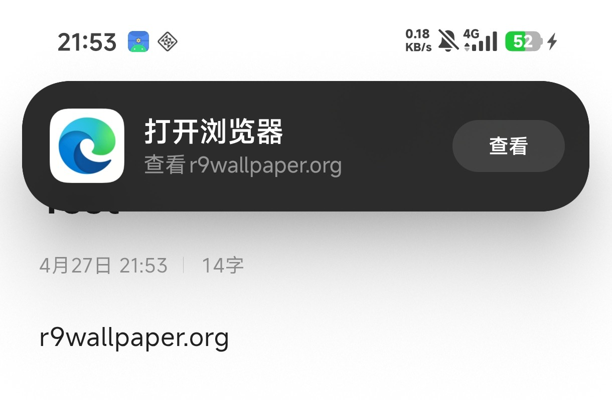
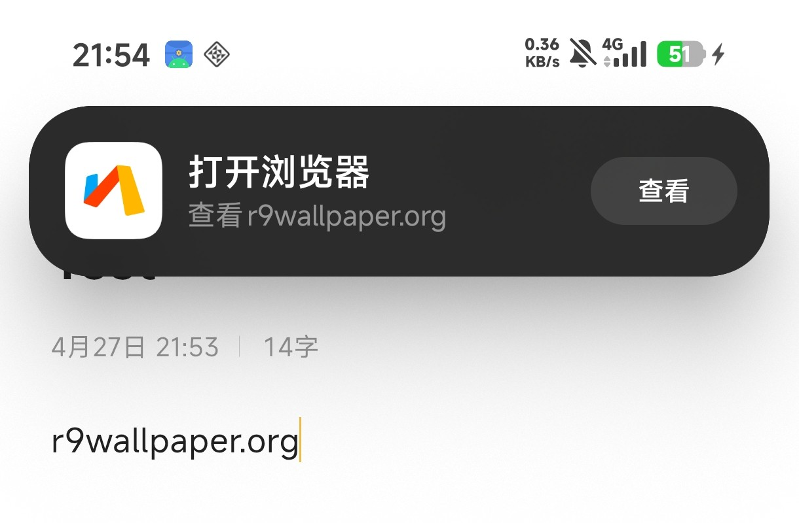
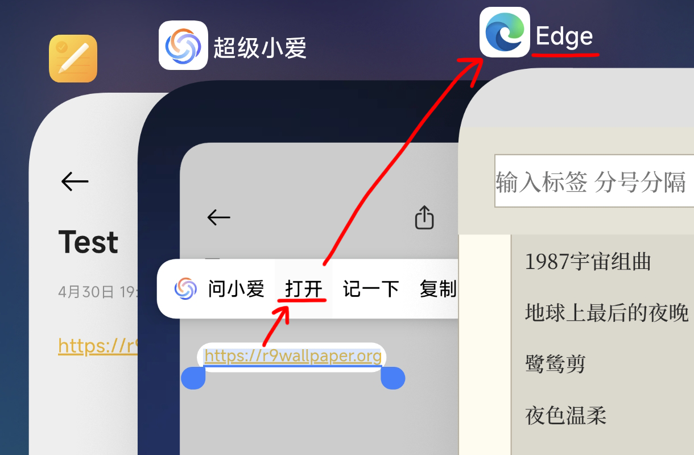

# 这是什么？

---

一款适用于 Xiaomi HyperOS 的 LSPosed 模块。

适配版本：理论通用

*测试设备为`Pudding`，OS版本`3.0.304.0`，小米澎湃AI引擎版本`3.16.0`*

*（其他设备理论兼容，请自行测试）*

# 核心功能
解除小米某些软件强制**绑定官方浏览器**的限制。

1. **接管剪贴板跳转**：将复制网址时弹出的通知，重定向至自定义浏览器，并同步替换通知图标。
2. **接管屏幕识别**：将“屏幕识别”功能打开的网址，替换为自定义浏览器。

# 如何使用

1. 安装并启用该模块。
2. 在 LSPosed 管理器中，勾选推荐的作用域(`com.xiaomi.aicr`,`com.miui.voiceassist`)。
3. 使用MT管理器在`/data/local/tmp/`目录下新建`browser.txt`文件。
4. 在`browser.txt`中，写入你想要替换的浏览器包名（如`com.microsoft.emmx`），并确保文件权限为所有用户可读(`644`)(一般不需要)。
5. 重启作用域内的软件。
6. 享受！

# 画廊

---

